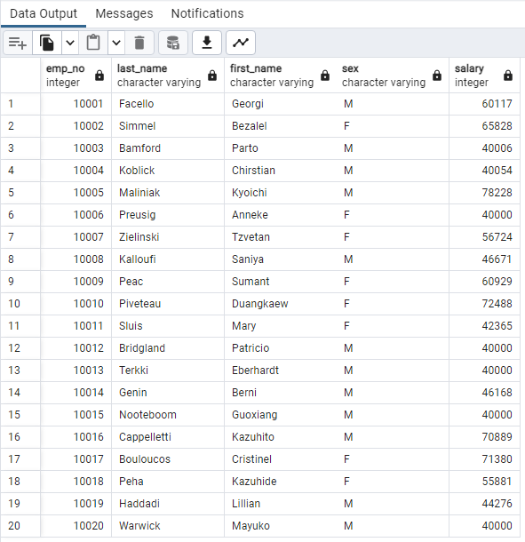
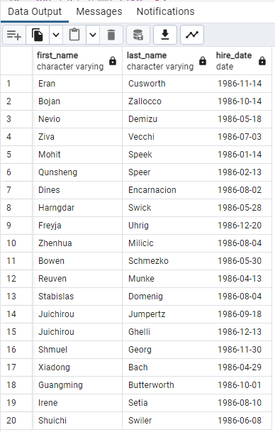
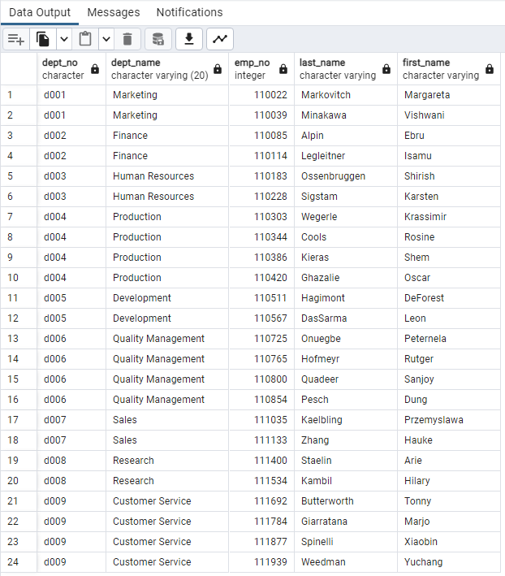
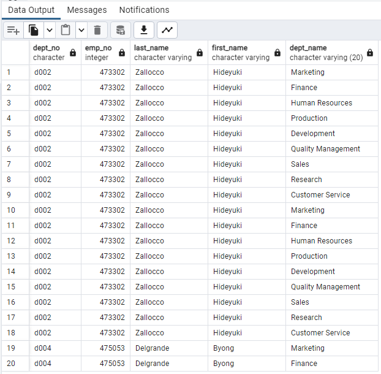
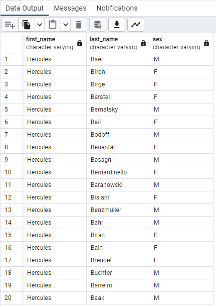
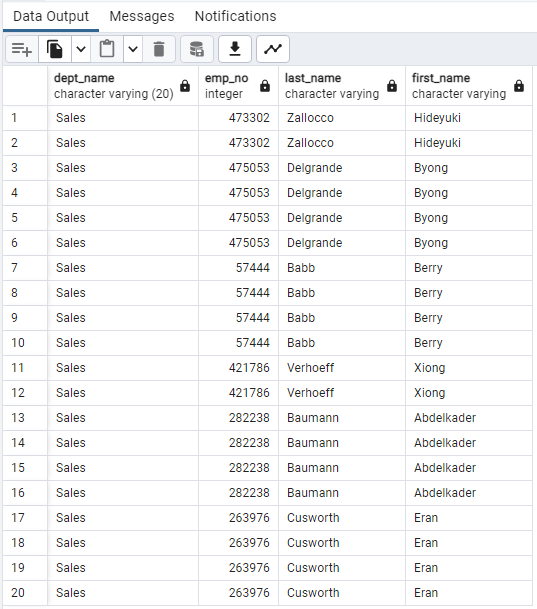
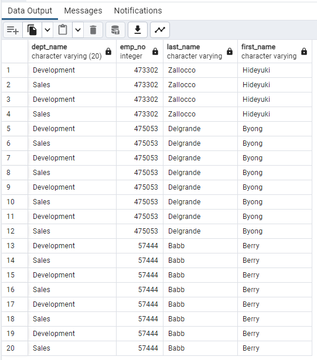
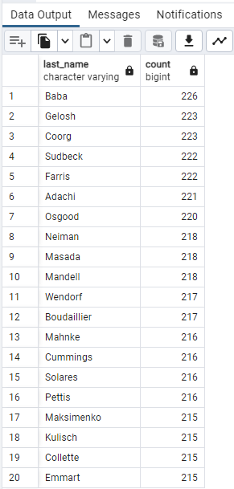

# sql-challenge
# Background
It’s been two weeks since you were hired as a new data engineer at Pewlett Hackard (a fictional company). Your first major task is to do a research project about people whom the company employed during the 1980s and 1990s. All that remains of the employee database from that period are six CSV files.

For this project, you’ll design the tables to hold the data from the CSV files, import the CSV files into a SQL database, and then answer questions about the data. That is, you’ll perform data modeling, data engineering, and data analysis, respectively.

# Instructions
This Challenge is divided into three parts: data modeling, data engineering, and data analysis.

# Data Engineering
In this section I used the provided information to create a table schema for each of the six CSV files. 
I was able to specify the data types, primary keys, foreign keys, and other constraints.
For the primary keys, I verified the unique columns, and created the tables in the correct order to handle the foreign keys.
I then imported each CSV file into its corresponding SQL table.

# Data Analysis
1. List the employee number, last name, first name, sex, and salary of each employee.

2. List the first name, last name, and hire date for the employees who were hired in 1986.

3. List the manager of each department along with their department number, department name, employee number, last name, and first name.

4. List the department number for each employee along with that employee’s employee number, last name, first name, and department name.

5. List first name, last name, and sex of each employee whose first name is Hercules and whose last name begins with the letter B.

6. List each employee in the Sales department, including their employee number, last name, and first name.

7. List each employee in the Sales and Development departments, including their employee number, last name, first name, and department name.

8. List the frequency counts, in descending order, of all the employee last names (that is, how many employees share each last name).

# Resourses
- AskBCS
- https://www.w3schools.com/sql/default.asp
- Tutors 
- Class recordings
